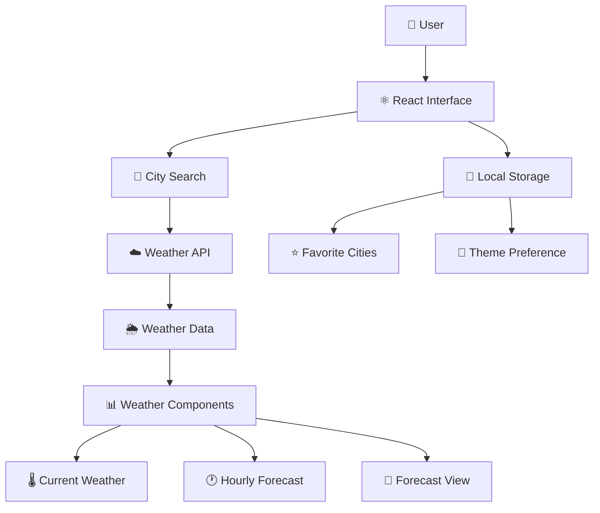

🌦️ WeatherLens

A modern, responsive weather application built with React.js that lets users search cities, explore current weather conditions, view forecasts, and manage favorite locations through a clean and interactive interface.

━━━━━━━━━━━━━━━━━━━━━━━━━━━━━━━━━━━━

✨ FEATURES

🌍 City Weather Search
Search for weather information for cities around the world.

🌡️ Current Weather
View temperature, feels-like temperature, humidity, wind speed, pressure and other weather information.

⭐ Favorite Cities
Save frequently visited cities and access them quickly.

🌙 Light & Dark Mode
Switch between themes for a more comfortable viewing experience.

🕐 Hourly Forecast
Explore upcoming hourly weather conditions through a dedicated forecast interface.

📅 5-Day Forecast
View upcoming weather conditions in an easy-to-understand forecast layout.

⚡ Loading Experience
Provides visual feedback while weather information is being retrieved.

⚠️ Error Handling
Handles unsuccessful requests and invalid searches gracefully.

📱 Responsive UI
Designed to provide a consistent experience across different screen sizes.

━━━━━━━━━━━━━━━━━━━━━━━━━━━━━━━━━━━━

🛠️ TECHNOLOGY STACK

Frontend
→ React.js
→ JavaScript
→ CSS
→ React Icons

API & Data
→ OpenWeather API
→ Fetch API

Browser Storage
→ LocalStorage

Development
→ Create React App
→ npm

━━━━━━━━━━━━━━━━━━━━━━━━━━━━━━━━━━━━

🏗️ APPLICATION ARCHITECTURE



━━━━━━━━━━━━━━━━━━━━━━━━━━━━━━━━━━━━

🔄 HOW IT WORKS

① Search
The user searches for a city through the application interface.

② Fetch
The application requests the corresponding weather information from the weather service.

③ Process
The received weather data is handled by the React application.

④ Display
Reusable components present current conditions and forecast information.

⑤ Personalize
Favorite cities and theme preferences are stored locally for a better user experience.

━━━━━━━━━━━━━━━━━━━━━━━━━━━━━━━━━━━━

📂 PROJECT STRUCTURE

```text
rainy/
│
├── public/
│
├── src/
│   ├── components/
│   │   ├── Favorites
│   │   ├── ForecastCard
│   │   ├── HourlyForecast
│   │   ├── SearchBar
│   │   ├── ThemeToggle
│   │   ├── WeatherCard
│   │   └── WeatherDetails
│   │
│   ├── styles/
│   │   └── themes.css
│   │
│   ├── App.js
│   ├── App.css
│   ├── index.js
│   └── index.css
│
├── package.json
└── README.md
```

━━━━━━━━━━━━━━━━━━━━━━━━━━━━━━━━━━━━

🧠 CONCEPTS DEMONSTRATED

⚛️ React Functional Components
🔄 State & Lifecycle Management
🧩 Component-Based Architecture
🌐 API Integration
⏳ Asynchronous Data Fetching
🔀 Conditional Rendering
⚠️ Error & Loading States
💾 Browser LocalStorage
📱 Responsive UI Design
♻️ Reusable Components
🌙 Theme Management
📊 Data-Driven Rendering

━━━━━━━━━━━━━━━━━━━━━━━━━━━━━━━━━━━━


━━━━━━━━━━━━━━━━━━━━━━━━━━━━━━━━━━━━

💡 PROJECT HIGHLIGHTS

🌦️ Built a responsive weather application using React.js.

🌐 Integrated a third-party weather service to retrieve live city-based weather information.

🧩 Designed reusable components for search, weather details, forecasts and interface controls.

⭐ Implemented persistent favorite-city functionality using browser storage.

🌙 Added persistent theme preferences for a personalized interface.

⚡ Added loading and error handling for improved user experience.

🎨 Implemented dynamic interface behavior based on weather conditions.

━━━━━━━━━━━━━━━━━━━━━━━━━━━━━━━━━━━━

🚀 FUTURE ENHANCEMENTS

📍 Location-Based Weather
📈 Weather Data Visualization
🔔 Weather Alerts
🌐 Improved Accessibility
📱 Progressive Web App Support
🌤️ Extended Forecast Information

━━━━━━━━━━━━━━━━━━━━━━━━━━━━━━━━━━━━


